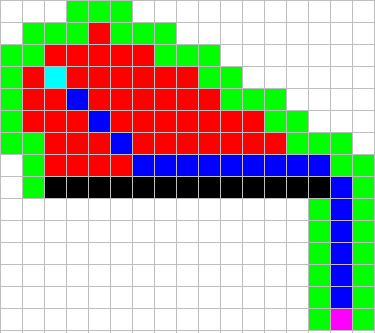
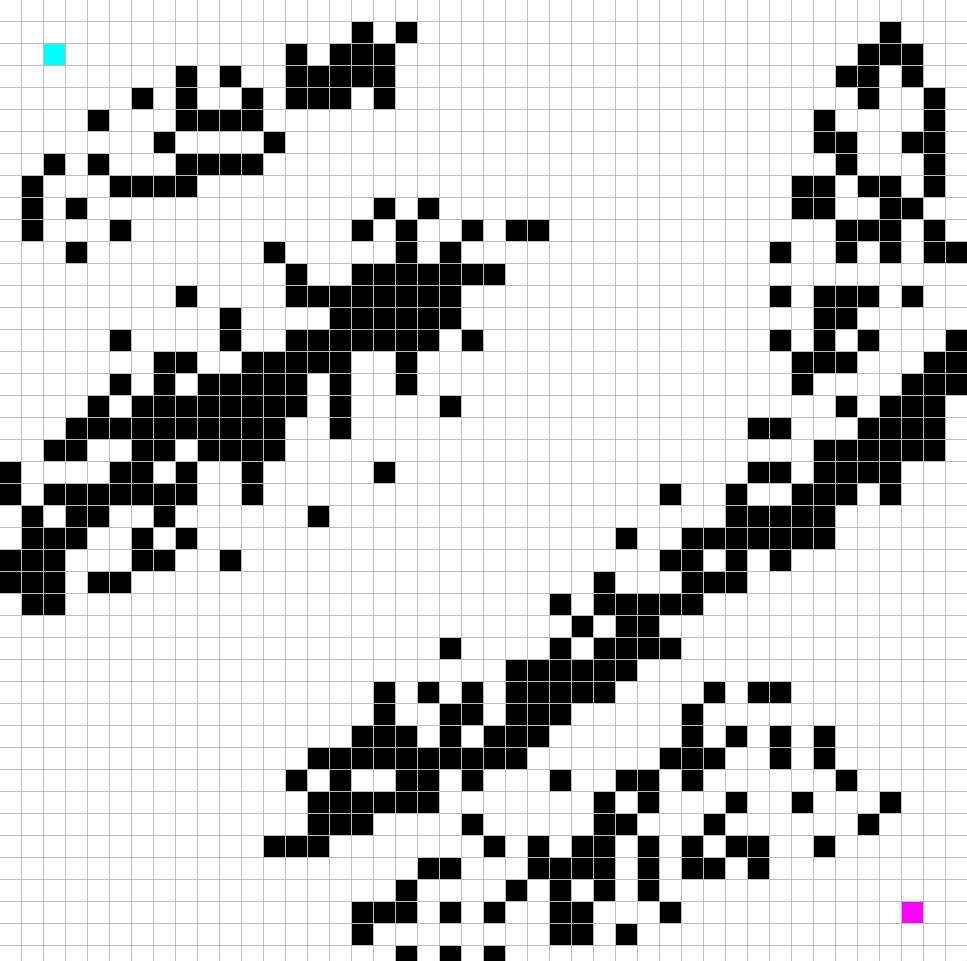
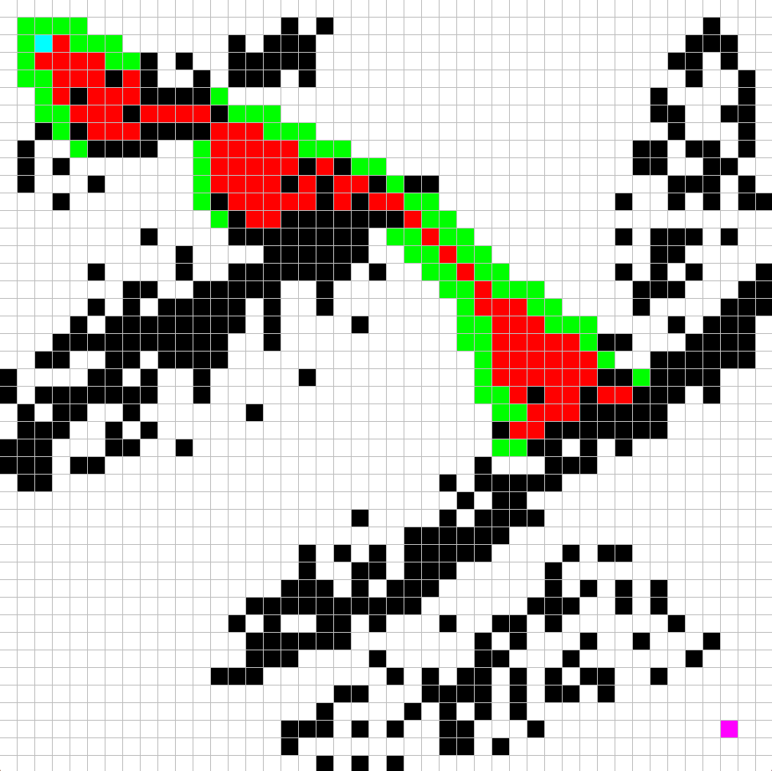

# A* Pathfinding Algorithm Visualizer

A visual representation of the A* pathfinding algorithm using Pygame, featuring customizable grids, obstacles, and real-time animation of the search process.

---

## Preview

<!-- Add a screenshot or GIF of the visualizer here -->


---

## Features

- Interactive grid for placing **start**, **end**, and **barrier** nodes
- Real-time visualization of the A* pathfinding algorithm
- Color-coded grid to represent node states (open, closed, path, etc.)
- Fully resettable and customizable with keyboard/mouse controls

---

## Color Key

| Color      | Purpose               |
|------------|------------------------|
| 🟦 Blue     | Final Path             |
| 🟥 Red      | Already Visited        |
| 🟩 Green    | Currently Being Checked|
| ⚪ White    | Not Visited            |
| ⚫ Black    | Barrier/Wall           |
| 🟪 Magenta  | End Node               |
| 🟦 Cyan     | Start Node             |

---

## Getting Started

### Requirements

Make sure you have Python 3 installed, and install the required libraries:

- `pygame`
- `numpy`

### Installation

```bash
pip install pygame numpy
```

### Running the Visualizer

```bash
python A_star_algorithm_pygame.py
```

---

## How to Use

| Action                  | Control                      |
|-------------------------|------------------------------|
| Set Start Node          | First **Left Click**         |
| Set End Node            | Second **Left Click**        |
| Add Barriers            | Additional **Left Clicks**   |
| Remove Node             | **Right Click**              |
| Start Pathfinding       | **Spacebar**                 |
| Clear the Grid          | **C Key**                    |

---

## Example Usage

```python
# Example:
# Step 1: Run the script
# Step 2: Click once to set the start node (cyan)
# Step 3: Click again to set the end node (magenta)
# Step 4: Click around to place barriers (black)
# Step 5: Press SPACE to start A* pathfinding
# Step 6: Watch the algorithm explore and draw the path (blue)
```

<!-- Add screenshots or specific use case examples here -->





---

## License

This project is licensed under the **MIT License**.  
You are free to use, modify, and distribute this software as you like.

---

